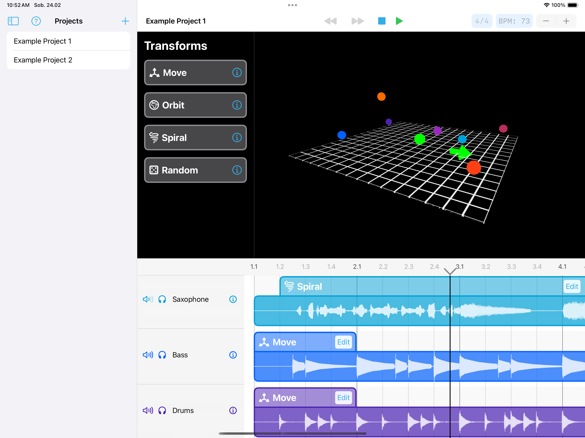
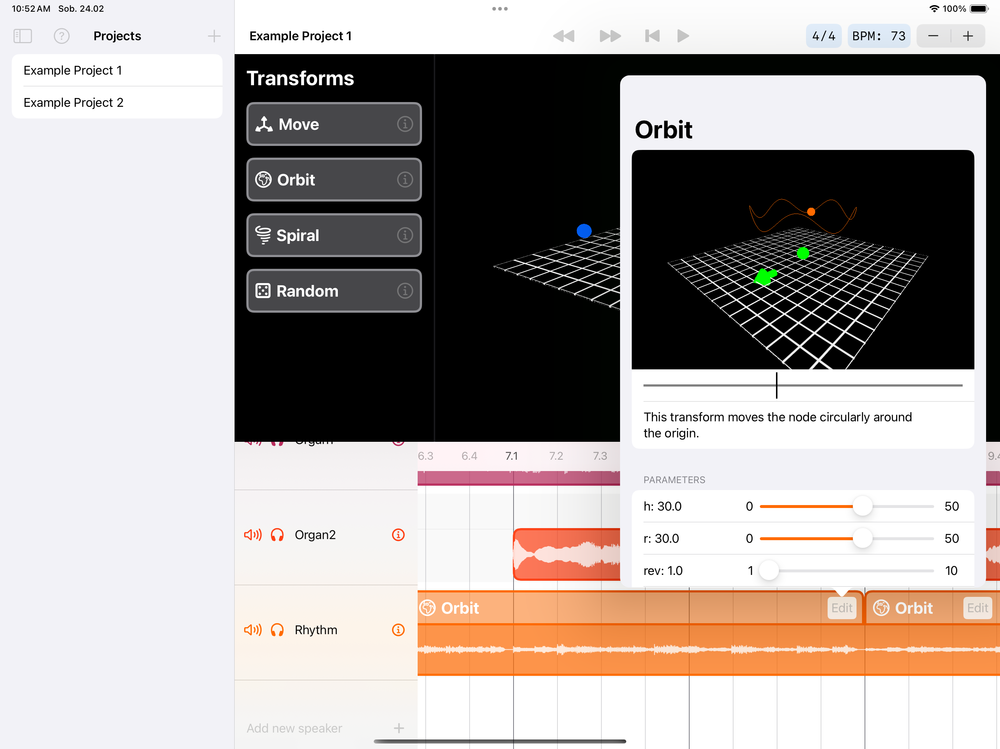
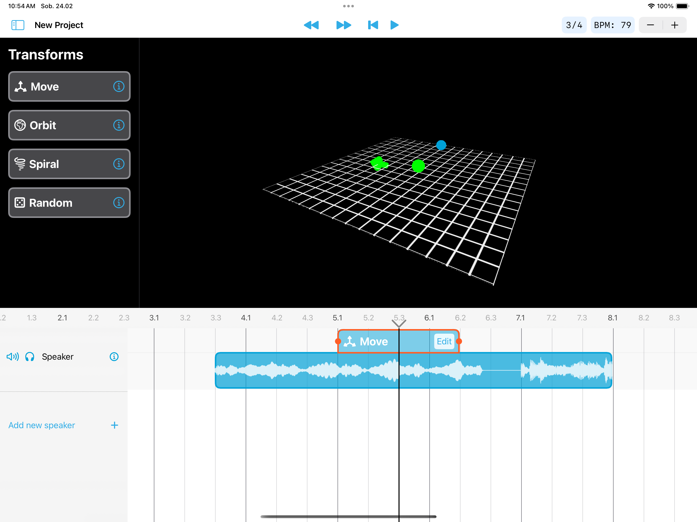

# Spatialize 

The app enables users to dynamically change position of virtual speaker in 3D space around them. The app is intuitive and easy to start with, but also supports many advanced features like e.g. multi track playback. In the app, user imports files onto the timeline with drag & drop interface and changes their position using selection of „transforms” which sit on the timeline next to the audio files. 

### Technologies used
- SwiftUI - Main interface
- SceneKit - 3D speaker node position preview
- PHASE - Real time spatial audio rendering
- Cobine - Updating contents of the 3D preview
- SwiftData - Data storage

### Running
Clone the repository and open it with swift playgrounds 4.4.1 or Xcode 15. The app supports iPadOS 17.0 and above.

